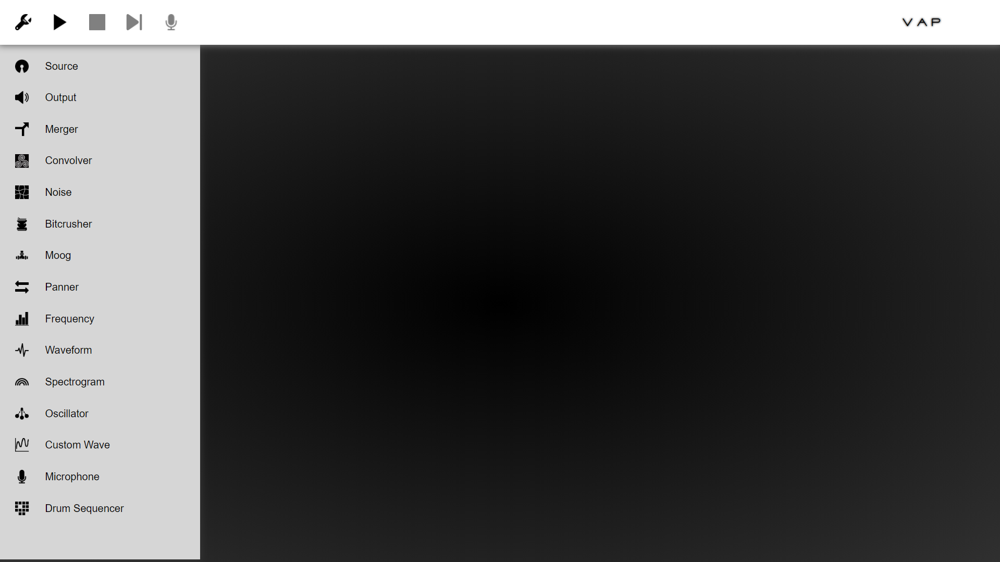
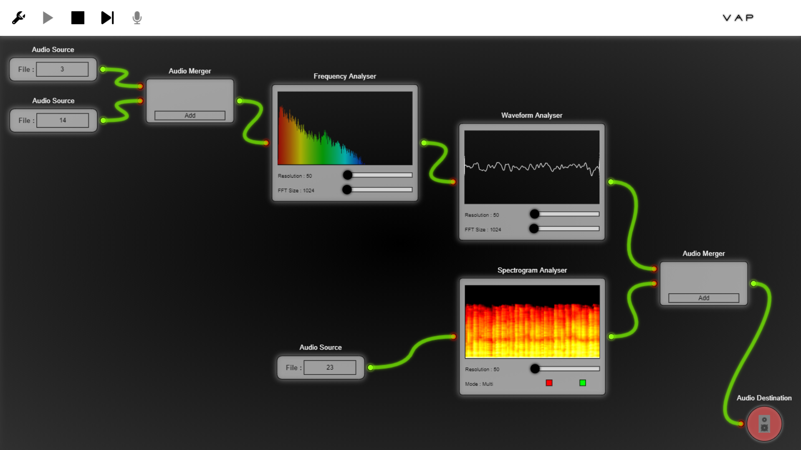
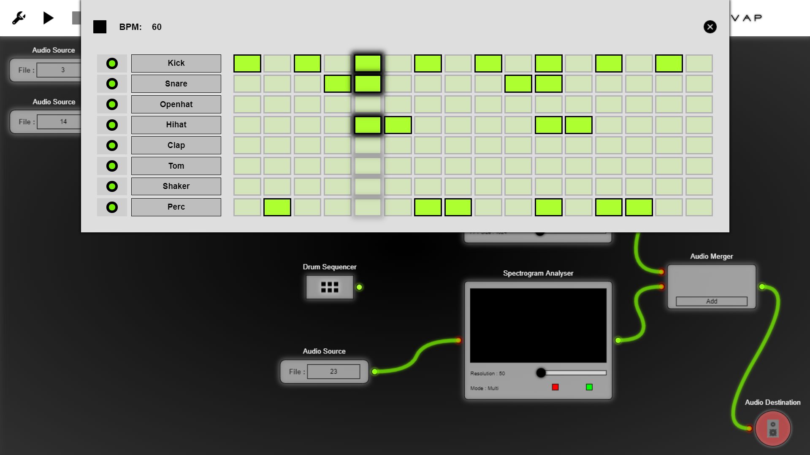

# vap

An online easy to use webapp for audio synthesis, processing, manipulation and visualization

Check this live [here](https://process-audio.herokuapp.com/)

Upload your audio and start mixing

* Multiple Audio sources
* Mix mutiple outpus
* Apply effects
* Mix drum sequence
* Frequency analysis
* Waveform analysis
* Spectrograph
* Record and Download
* Easy to use Node-editor (connect and play)

Infinite no. of combinations !
